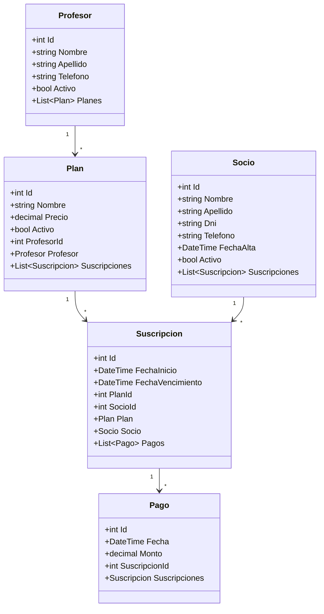

# Diagrama de Clases

```mermaid
classDiagram
    class Profesor {
        +int Id
        +string Nombre
        +string Apellido
        +string Telefono
        +bool Activo
        +List~Plan~ Planes
    }
    class Plan {
        +int Id
        +string Nombre
        +decimal Precio
        +bool Activo
        +int ProfesorId
        +Profesor Profesor
        +List~Suscripcion~ Suscripciones
    }
    class Suscripcion {
        +int Id
        +DateTime FechaInicio
        +DateTime FechaVencimiento
        +int PlanId
        +int SocioId
        +Plan Plan
        +Socio Socio
        +List~Pago~ Pagos
    }
    class Socio {
        +int Id
        +string Nombre
        +string Apellido
        +string Dni
        +string Telefono
        +DateTime FechaAlta
        +bool Activo
        +List~Suscripcion~ Suscripciones
    }
    class Pago {
        +int Id
        +DateTime Fecha
        +decimal Monto
        +int SuscripcionId
        +Suscripcion Suscripciones
    }
    Profesor "1" --> "*" Plan
    Plan "1" --> "*" Suscripcion
    Suscripcion "1" --> "*" Pago
    Socio "1" --> "*" Suscripcion
```